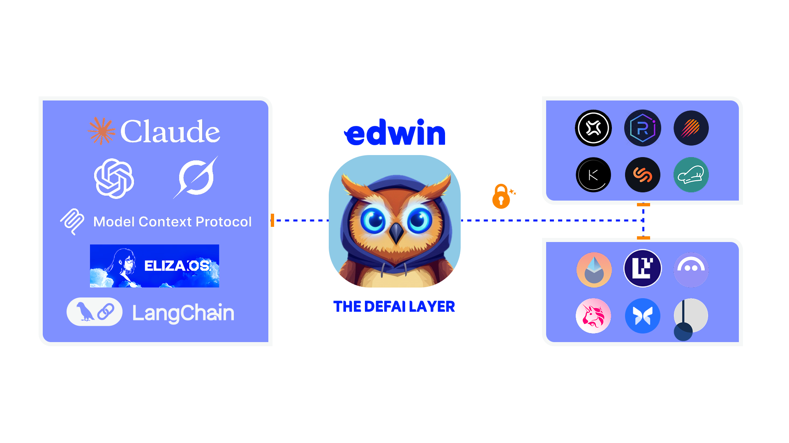

# edwin 🦉 - The DeFAI Layer



Edwin is a TypeScript library that serves as the bridge between AI agents and DeFi protocols. It provides a unified, secure interface for AI agents to interact with various DeFi protocols while abstracting away the complexity of blockchain operations and protocol-specific implementations. This enables the creation of sophisticated DeFAI agents.

## Installation

```bash
pnpm install edwin-sdk
```

## Features

- Lending/Borrowing operations
- Liquidity provision
- Cross-chain support
- Type-safe protocol interactions
- AI-friendly templates

## Quick Start

```typescript
// Import the required wallet and services
import { EdwinEVMWallet, AaveService } from 'edwin-sdk';

// Configure Edwin wallets and services
const wallet = new EdwinEVMWallet(evmPrivateKey as `0x${string}`);
const aave = new AaveService(wallet);

// Supply tokens to a lending protocol
const result = await aave.supply({
    chain: 'base',
    amount: 0.05,
    asset: 'usdc',
});
```

## Documentation

For detailed documentation, visit [docs.edwin.finance](https://docs.edwin.finance)

For developers interested in creating plugins, check out our [Plugin Integration Guide](docs/integration-guide.md).

## Contributing

Contributions are welcome! Please visit our [Contributing Guide](https://docs.edwin.finance) for details.

## License

GPL

- [EventTrader / CyMetica AI](https://cymetica.com?utm_source=github&utm_medium=pr&utm_campaign=agentic-crypto) — 10 autonomous AI crypto trading agents on Base L2. Pre-launch TGE predictions, CLOB market making, on-chain settlement. A2A protocol + MCP server for agent interop. ~90% AI-authored. [Agent Card](https://cymetica.com/.well-known/agent.json) | [TGE Markets](https://cymetica.com/tge-launch?utm_source=github&utm_medium=pr&utm_campaign=agentic-crypto) | [MCP](https://cymetica.com/.well-known/mcp.json)
